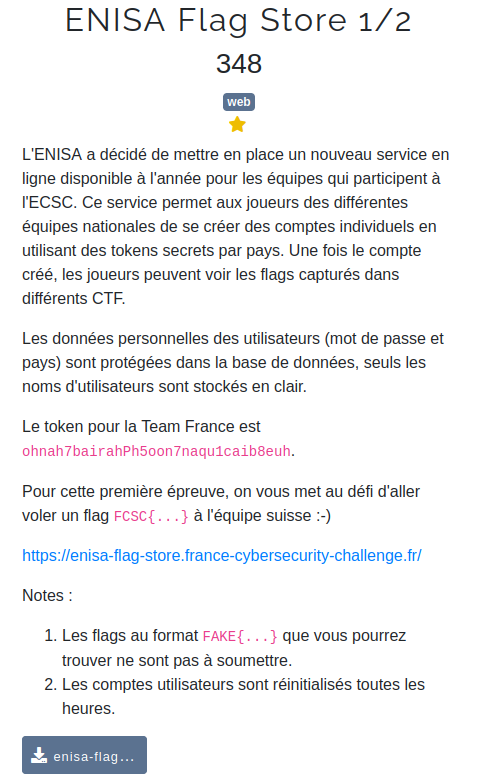
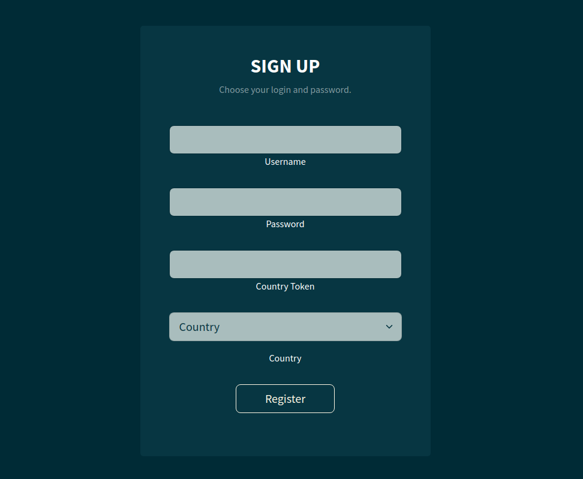
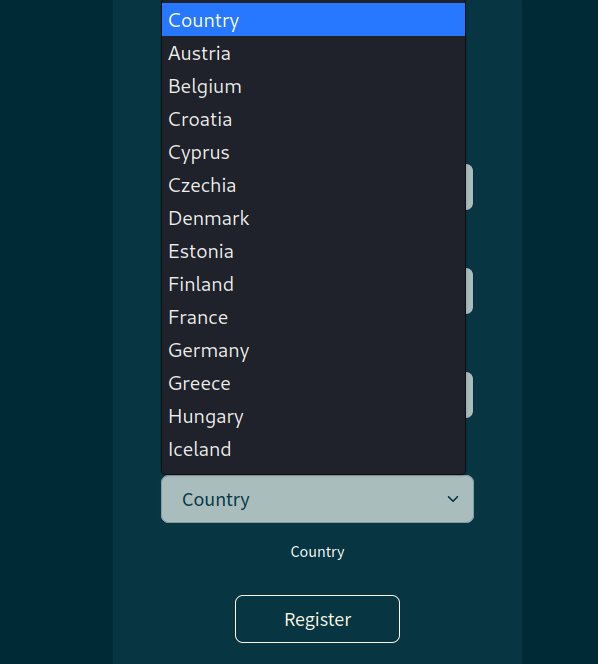
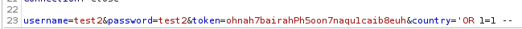
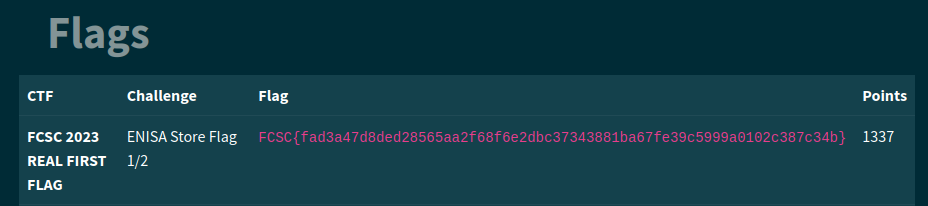

# Reconnaissance

Here's the challenge, a .go file is given too with the link to the website :  

  

There's a mention of a database : we directly plan to do a sqli

  

So we see a classic signup page  

```
func getData(user User) (
    []Flag,
    error,
) {
    var flags []Flag

    req := fmt.Sprintf(`SELECT ctf, challenge, flag, points
                        FROM flags WHERE country = '%s';`, user.Country);
    rows, err := db.Query(req);
    if err != nil {
        return flags, err
    }
    defer rows.Close()

    for rows.Next() {
        var flag Flag
        err = rows.Scan(&flag.CTF, &flag.Challenge, &flag.Flag, &flag.Points)
        if err != nil {
            return flags, err
        }
        flags = append(flags, flag)
    }
    if err = rows.Err(); err != nil {
        return flags, err
    }

    return flags, nil
}
```

Returning back to the code, we have to analyze it. All the sql requests in the .go file are prepared, except one in the getData function... Does that mean that we could exploit it ? 👀  
By analyzing the code, we understand that getData is called in show_flags, which is called itself when we go to the /flags section in the website. So the plan is to inject what we want in the country field, which can be modified only once : during the signup !  

# Exploitation

  


 

The problem is that we're forced to select a country, so we can't inject our payload. But using BurpSuite, it is possible !

  

Then we go to /flags, and we see the flag appearing at the top ! (if i didn't inject the payload it would print only the french flags related to my token and not this one) 
