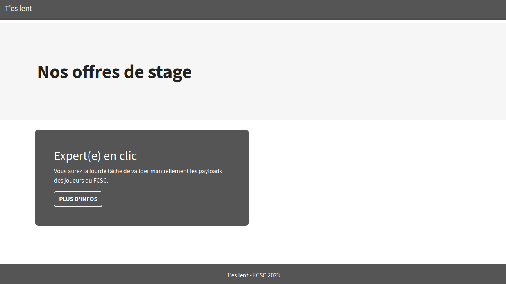
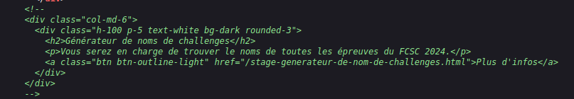
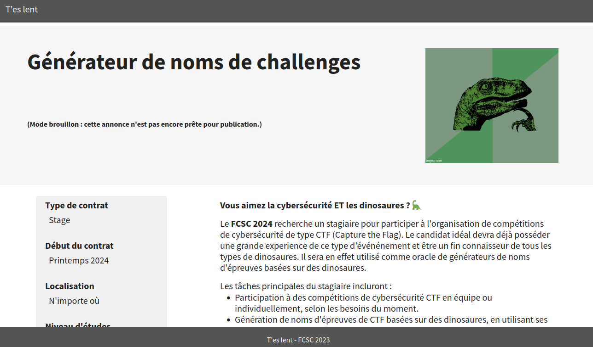
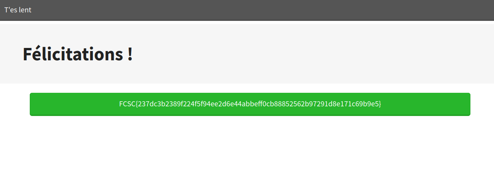

# Reconnaissance

Here's the first page

  

# Exploitation

The first thing that we must check is the source code, we see a reference to another page, let's go to it 

  

 

In this page we also check the source code, it gives us a reference to the last page containing the flag !

 
